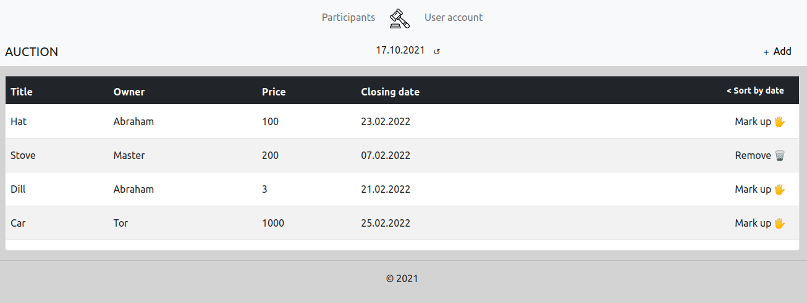
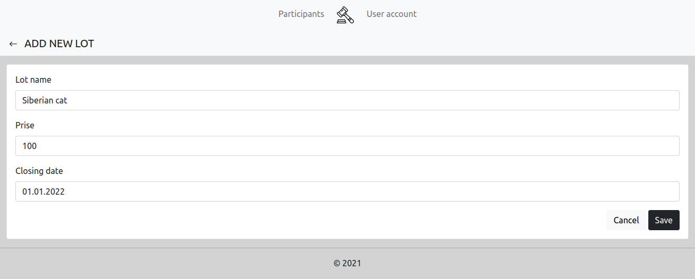
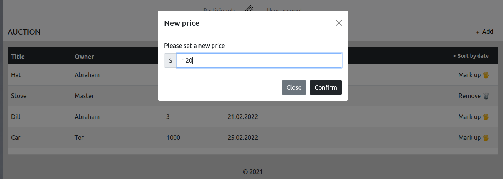
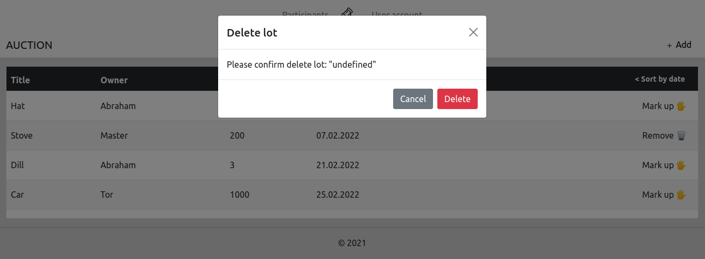
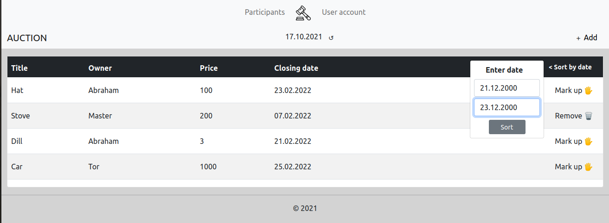
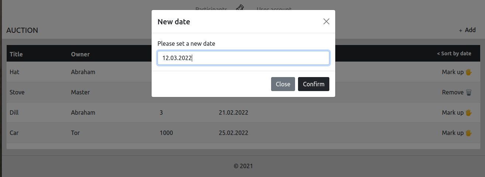
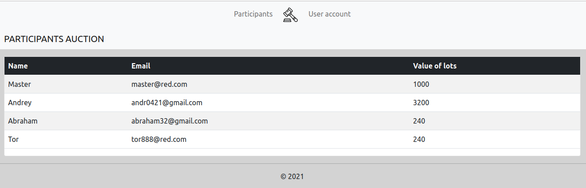
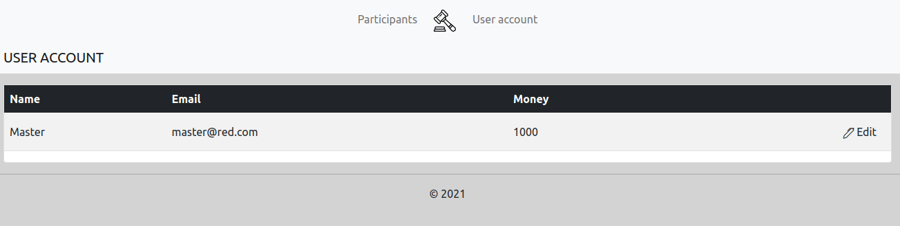
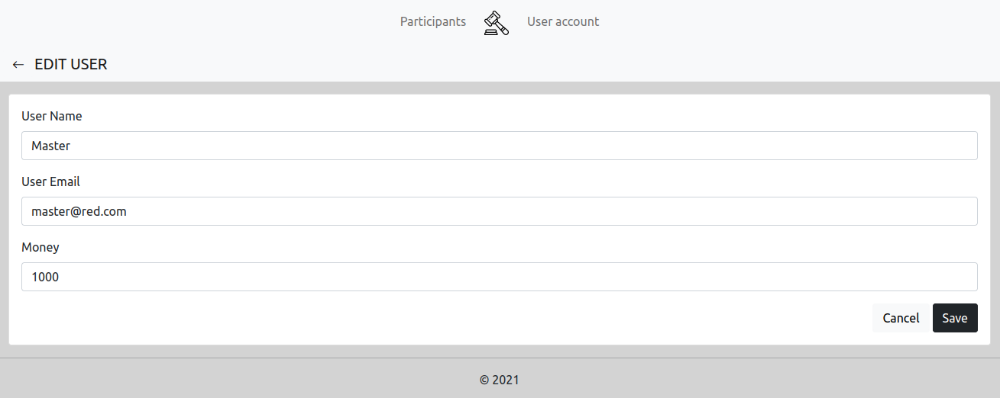

# Онлайн Аукцион
Требуется Web приложение для размещения и покупки товаров в форме аукциона.
Приложение должно реализовывать следующие функции:
* Просмотр полного списка лотов. Изменение цены лота. Удаление своего лота.
* Просмотр списка всех участников аукциона.
* Просмотр информации об авторизированном пользователе. Редактирование аккаунта.
* Должна быть реализована фильтрация списка лотов по дате закрытия

##Кнопки в хедере страницы:
* Participants - переход в режим просмотра списка участников аукциона
* Auction - переход в режим просмотра списка лотов
* User Account - переход в режим просмотра информации об аккаунте

## 1. Аукцион
## 1.1 Просмотр списка лотов
Данный режим программы предназначен для просмотра списка лотов.
Основной сценарий:
* Пользователь выбирает пункт меню "Auction".
* Открывается форма просмотра лотов

В списке отображаются следующие колонки:
* Title - название лота
* Owner - владелец лота
* Price - цена лота
* Closing - дата закрытия лота

В форме просмотра списка плейлистов доступны кнопки:
* add - для добавления лота
* delete - для удаления лота
* mark up - для изменения цены лота
* update date - тестовое обновление даты
* Sort by date - для сортировки лотов по дате
  

## 1.2 Добавление лота
Основной сценарий:
* Находясь в форме просмотра списка лотов пользователь нажимает кнопку "add"
* Отображается форма добавления лота
* Пользователь вводит данные и нажимает кнопку "save"
* Если данные сохранены успешно, то открывается форма просмотра лотов

В форме добавления лотов доступны кнопки:
* save - для добавления лота
* cancel - для возврата к форме списка товаров
* <- - для возврата к форме списка товаров
  

## 1.3 Изменение цены лота
Основной сценарий:
* Находясь в форме просмотра списка лотов пользователь нажимает кнопку "edit"
* Отображается форма редактирования лота
* Пользователь вводит данные и нажимает кнопку "save"
* Если данные сохранены успешно, то открывается форма просмотра списка лотов

В форме редактирования лотов доступны кнопки:
* save - для сохранения новой цены лота
* cancel - для возврата к форме списка лотов
  

## 1.4 Удаление лота
Основной сценарий
* Находясь в форме просмотра лотов пользователь нажимает кнопку «delete».
* Отображается форма удаления лота
* Если пользователь нажимает кнопку «delete», то происходит удаление лота
* Если удаление прошло успешно, то открывается форма просмотра списка лотов

В форме удаления лотов доступны кнопки:
* delete - для удаления лота
* cancel - для возврата к форме списка лотов
  

## 1.5 Фильтрация списка лотов
Основной сценарий:
* Находясь в форме просмотра списка лотов пользователь нажимает кнопку "Sort by date".
* Появляется окно ввода дат начала и конца периода фильтрации.
* Если пользователь нажимает кнопку "Sort" происходит переход к отфильтрованному списку лотов.
  

## 1.6 Тестовое изменение даты 
Основной сценарий:
* Находясь в форме просмотра списка лотов пользователь нажимает кнопку "update date"
* Отображается форма редактирования даты
* Пользователь вводит данные и нажимает кнопку "save"
* Если данные сохранены успешно, то открывается форма просмотра списка лотов, отображается установленная дата.

В форме редактирования даты доступны кнопки:
* save - для сохранения даты
* cancel - для возврата к форме списка лотов
  

## 2 Участники аукциона
## 2.1 Просмотр списка участников
Данный режим программы предназначен для просмотра списка участника аукциона.
Основной сценарий:
* Пользователь выбирает пункт меню "Participants".
* Открывается форма просмотра всех участников.

В списке отображаются следующие колонки:
* Name - имя учасника
* Email - email участника
* Value of lots - стоимость всех лотов участника

  

## 3 Пользовательский аккаунт
## 3.1 Просмотр информация о текущем аккаунте
Данный режим программы предназначен для просмотра, и редактирования текущего аккаунта.
Основной сценарий:
* Пользователь выбирает пункт меню "User account".
* Открывается форма просмотра всех песен

В форме просмотра информации об аккаунте доступны кнопки:
* edit - для редактирования информации об аккаунте
  

## 3.2 Редактирование текущего аккаунта
Основной сценарий:
* Находясь в форме просмотра информации об аккаунте пользователь нажимает кнопку "edit"
* Отображается форма редактирования аккаунта
* Пользователь вводит данные и нажимает кнопку "save"
* Если данные сохранены успешно, то открывается форма просмотра информации об аккаунте

В форме редактирования песни доступны кнопки:
* save - для сохранения редактирования песни
* cancel - для возврата к форме списка песен
* <- - для возврата к форме списка песен
  

